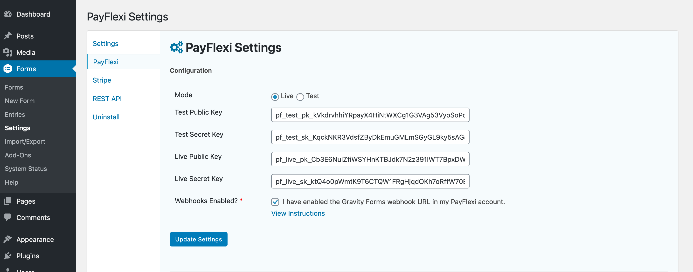

# PayFlexi Instalment Payment Gateway for Gravity Forms

## Introduction
PayFlexi Instalment Payment Gateway for Gravity Forms allows you to quickly and easily implement installment payments with WordPress. With the PayFlexi Flexible Checkoy Add-On you can allow your customers to be for product and services in flexible installment.

PayFlexi works with your existing payment gateway processor, and we currently support these gateways:

- **Stripe**
- **PayStack**
- **Flutterwave**

## Pre-Requisites
- Gravity Forms v2.4+
- WordPress v5.1+
- SSL Certificate Installed and - Configured
- Download and install the add-on
- A PayFlexi Merchant account

## PayFlexi Settings
The PayFlexi Settings will allow you to connect and authenticate with your PayFlexi Merchant Account and it will allow you to setup webhooks which are used to communicate events from PayFlexi back to your Gravity Forms environment.

Navigate to your PayFlexi Flexible Checkout Add-On Settings page:

1. Log into your WordPress admin dashboard.
2. On the left side navigation menu, hover over Forms and click on Settings.
3. Click the PayFlexi tab.

### Mode
Allows you to specify the default environment you want to send your form submission to. Choosing Live will initiate real transactions, while Test will run the form entry into your PayFlexi test environment, which should not generate any real transactions.